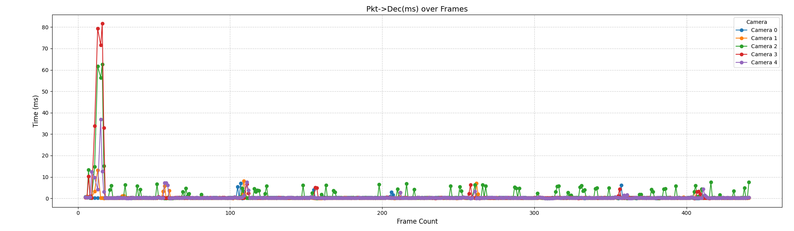
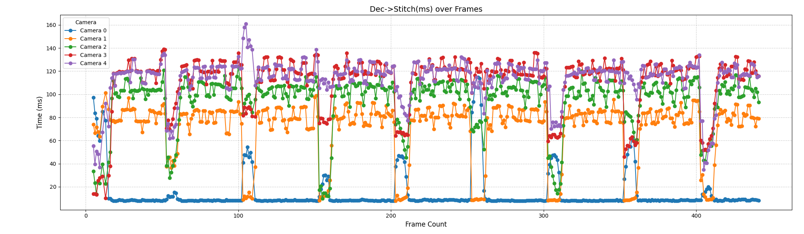
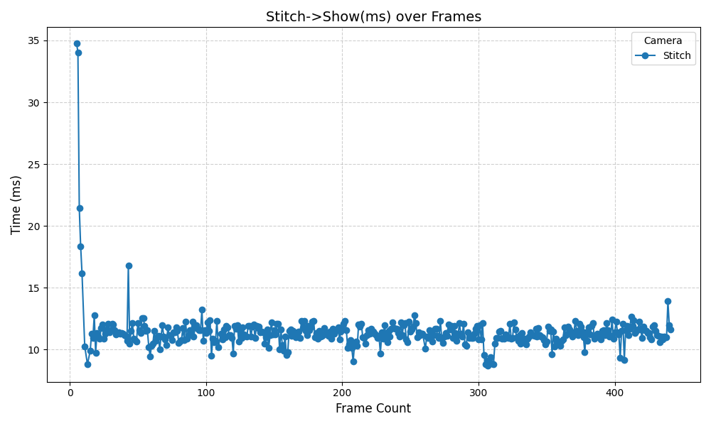
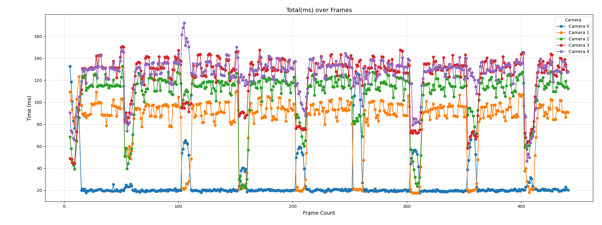
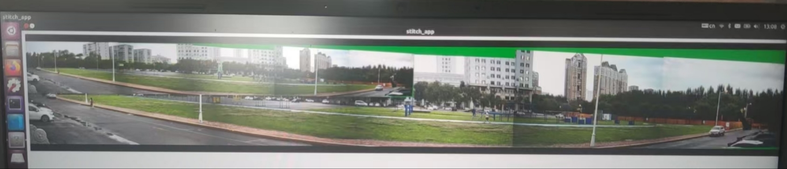

# 🚀 基于异构平台的视频拼接项目

本项目旨在实现一个高性能、低延迟的**多路视频实时拼接系统**。
系统利用**CUDA GPU加速**与**多线程优化**技术，能够同时从多路相机采集视频流，进行解码、拼接、显示与性能监测。
在未来，还会加入**华为昇腾**、**jetson orinX**等异构平台。

---

## 🧩 项目特点

- 🔹 **多摄像头实时拼接**：支持多路 RTSP 或本地视频输入。
- 🔹 **GPU 加速**：基于 CUDA 实现高效视频处理与图像拼接。
- 🔹 **多线程架构**：采用生产者-消费者模型，保证数据流畅。
- 🔹 **性能监测模块（Timing Watcher）**：
  自动记录每个处理阶段的耗时（如接收、解码、拼接、显示），并输出为 CSV 文件，方便后续性能分析与可视化。
- 🔹 **Qt 界面展示**：提供实时拼接结果显示与调试界面。
- 🔹 **模块化设计**：核心逻辑与界面层完全解耦，易于扩展与维护。

---

## 🧱 前置条件

| 环境 | 最低要求 |
|------|-----------|
| NVIDIA 驱动 | ≥ 535 |
| CUDA | ≥ 11.8 |
| FFmpeg | 需要手动编译，支持硬件编解码 |
| openGL | 任意版本 |
| Qt | ≥ 5.0 |
| spdlog | 任意版本 |

---

## ⚙️ 编译及打包步骤

```bash
# 1️⃣ 下载所需镜像（环境依赖）
make stitch_env

# 2️⃣ 编译程序
make build

# 3️⃣ 打包部署
make deploy
```

---

## 📁 目录结构

```
stitch/
├── CMakeLists.txt                  # 顶层构建配置
├── Makefile                        # 构建与打包入口
├── main.cpp                        # 程序主入口
├── inc/                            # 全局头文件
├── components/                     # UI 模块（Qt 实现）
│   ├── qt/
│   └── CMakeLists.txt
├── core/                           # 核心逻辑模块
│   ├── config/                     # 配置读取模块
│   ├── operator/                   # 异构 算法实现
│   │   ├── nvidia/
│   │   ├── ascend/
│   ├── data_processing/            # 数据处理与拼接流程
│   ├── utils/                      # 工具类库
│   │   ├── include/
│   │   │   ├── log.hpp             # 日志封装
│   │   │   ├── tools.hpp           # 常用工具
│   │   │   ├── safe_queue.hpp      # 线程安全队列
│   │   │   ├── safe_list.h         # 线程安全链表
│   │   ├── src/
│   │   └── CMakeLists.txt
│   └── CMakeLists.txt
├── camera_manager/                 # 摄像头与任务管理模块
├── scripts/
│   └── plot_timing.py              # 性能可视化脚本
├── resource/
│   ├── hk5.json
│   └── hk8.json
└── README.md
```

---

## 📊 各阶段耗时曲线

1️⃣ 视频解码耗时


2️⃣ 拼接阶段耗时


3️⃣ 显示阶段耗时


4️⃣ 全流程耗时


---

## 🖼️ 最终效果图



图中是使用 `hk5.json` 文件配置生成的五路拼接图像的效果，目前平均延时可以做到 ≤300ms。