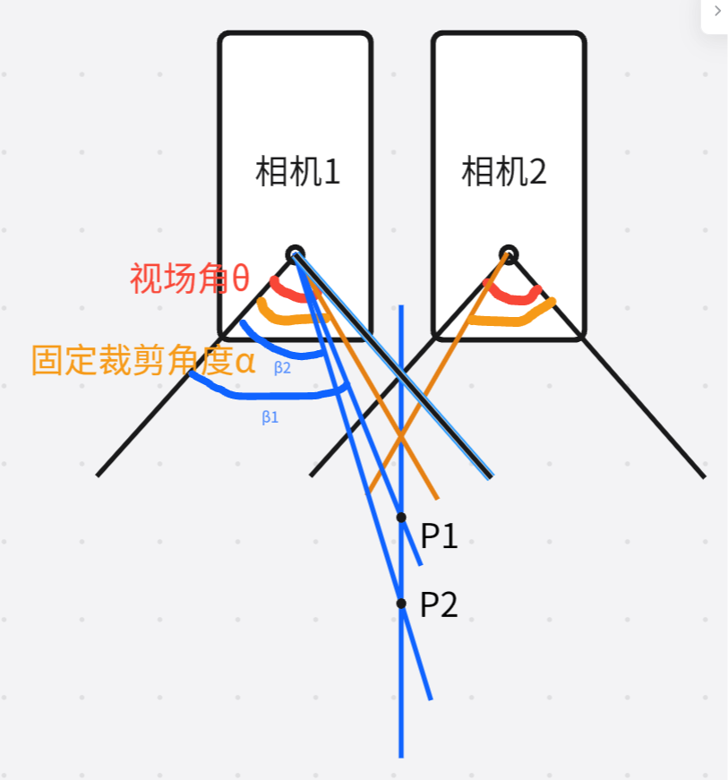

#关于距离对拼接产生的误差

无论哪种拼接方法，核心都是固定比例的裁剪，那就会有目标距离的问题

如图所示，为两相机平行放置的简化模型，同一列的目标点P1和P2，由于到相机光心的距离不同，
两点在相机1的角度就会不同，P1形成β1角，P2形成β2角，
假设P1到相机1光心的水平距离为x，竖直距离为y1，则有
β1=θ/2 + π/2 - arctan(y1/x),那么P1点及其往左的所有点，
占据相机1的像素宽度的比例为：Pw1=β1/θ=50%+(π/2 - arctan(y1/x))/θ
即一个无限宽的平面，水平放在P1点的位置，平面在拼接后的图像中，
也只会显示w的Pw1部分，w是一个相机的完整图像宽度。
假设相机的θ为2π/3，x为0.1m，y1为15m，则Pw1等于50.32%