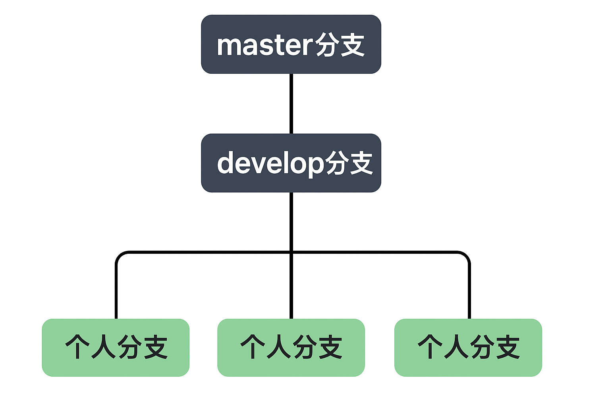
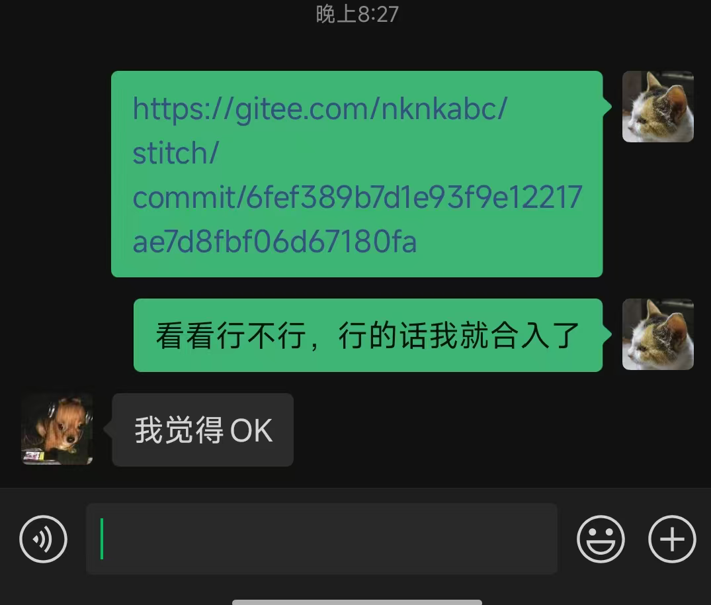

# 如何入门该项目

初来乍到，想要熟悉stitch项目，需要从下面几个方向出发

## 下载项目

我们的项目都托管在gitee上，如果想要运行，需要下载下来，本地需要安装git，然后执行git clone。
但是没有提交权限，这时有两种办法：
1. **fork 仓库** ：在自己的账户下创建副本，自由修改。
2. **加入团队仓库** ：但仓库最多只能容纳 5 个成员，因此成员满时可能无法使用此方式。

## 配置环境

我们的代码都是运行在linux系统上的，并且需要自己安装一些库，最主要的就是cuda、ffmpeg（需自己编译）、spdlog、openGL、Qt，也可以通过运行**set_env.sh**，直接一键化配置环境。

## 编译并运行代码

通过运行下面一行命令，可以直接运行代码：

```bash
    bash start_camera.sh -c [配置文件]
```

通过输入的配置文件名字，脚本会自动输入resource目录下对应的json文件，比如输入为**cam10**，那么就会直接使用**cam10.json**以及 **cam10/** 目录下的东西作为配置文件

## 如何提交代码

在提交代码之前，先解释一下这几个分支的用途：

1. **master分支**：项目的最稳定分支，用于对外发布。不允许直接在 master 上开发或提交代码，只能通过从 develop 发起 pull request 的方式合入。
2. **develop分支**：日常开发的主集成分支。所有新功能都必须从 develop 分支 checkout 一个新的个人分支进行开发，完成后再通过 pull request 合入 develop。
3. **个人分支（命名规则自己安排，建议用自己名字拼音）** ：个人开发分支，开发好的功能，可以先通过 **git push origin <个人分支>** 推到远程仓库，之后再通过pull request合入develop分支。
4. **其他分支**：比如jetson_stitch（专门针对orinX平台的适配分支）、ascend_stitch（专门针对ascend板卡的适配分支），这两个分支没有加锁，小心push的时候 **不要使用--force** ，导致commit丢失。这些分支通常不需要从 master/develop 合并回去。


介绍完各个分支的用途，现在说明一下一个简单的开发流程：

1. 明确修改的功能。
2. 如果是第一次，那么从develop分支checkout一个新分支；如果不是，可以先执行 **git fetch origin** ，再执行 **git rebase origin/develop** ，确保是最新的develop分支代码。
3. 修改代码，注意修改完代码后一定要 **编译运行** 一次，确保没有问题。
4. 修改完代码后，通过 **git status** 查看修改状态，然后通过**git add .** 保存在暂存区。
5. 通过**git commit -m "修改内容（查看历史 commit 命名方式，确保清晰可读）"**，之后再通过 **git push origin <个人分支>** 推到远程仓库。
6. 在远程仓库gitee界面发起pull request，合入develop分支，要找人进行code review，确保代码没有可读性差的问题，之后合入。
