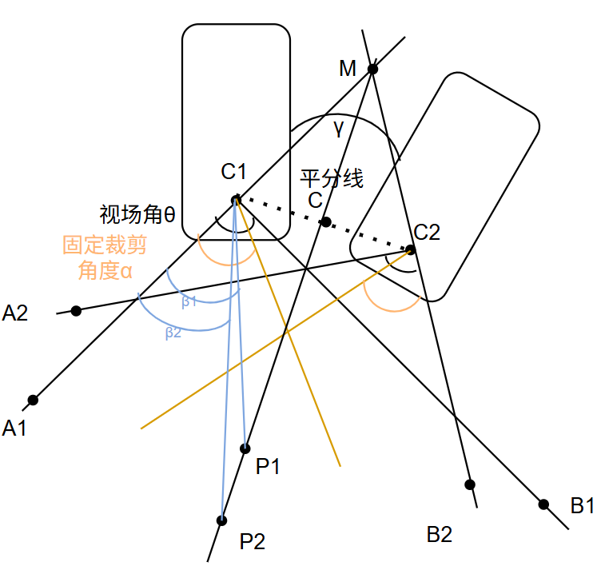
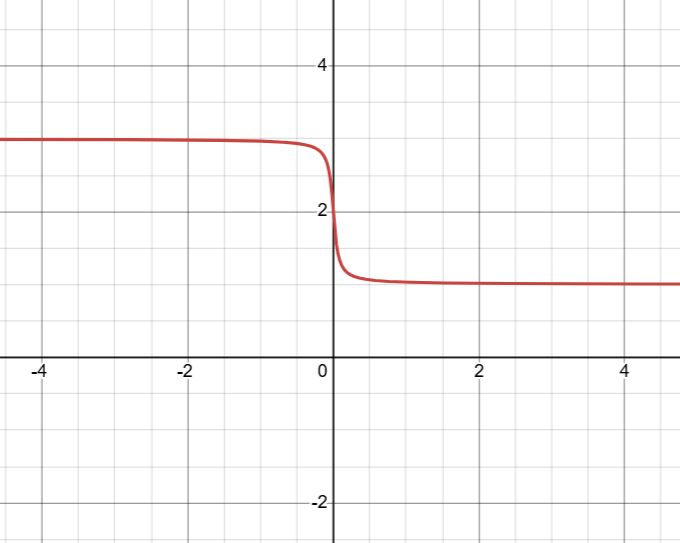

# 关于距离对拼接产生的误差

无论哪种拼接方法，核心都是固定比例的裁剪，那就会有目标距离的问题

如图所示，为两相机平行放置的简化模型，同一列的目标点P1和P2，由于到相机光心的距离不同，

两点在相机1的角度就会不同，P1形成β1角，P2形成β2角，

假设P1到相机1光心的水平距离为x，竖直距离为y1，则有

β1=θ/2 + π/2 - arctan(y1/x),那么P1点及其往左的所有点，

占据相机1的像素宽度的比例为：Pw1=β1/θ=50%+(π/2 - arctan(y1/x))/θ

即一个无限宽的平面，水平放在P1点的位置，平面在拼接后的图像中，

也只会显示w的Pw1部分，w是一个相机的完整图像宽度。

假设相机的θ为2π/3，x为0.1m，y1为15m，则Pw1等于50.32%

两相机不平行时：

A1C1与A2C2的夹角为γ，角C1 M C2为θ-γ，角C1 M C为(θ-γ)/2,角A1 C1 C等于Π/2+θ/2-γ/2，

角(P1 C1 C)等于arctan(C P1/C C1)，β1=角(A1 C1 C)-角(P1 C1 C)

β1=Π/2+θ/2-γ/2-arctan(C P1/C C1)

当θ=2Π/3，γ=-1Π/3，C1 C2=0.1m，(C P1)=1m，（即当两个相机不向内聚拢，而是向外散开时）

则角P1 C1 C=87°，β1=Π/2+θ/2-γ/2-87°=93°

当α取Π/2时，P1位置占裁剪图像的宽度位置比例为β1/α=(Π-arctan(C P1*20))*2/Π

β1/α,C P1的图像为

可以看到，C P1为0.5m以内时，占比β1/α才开始剧烈上升
