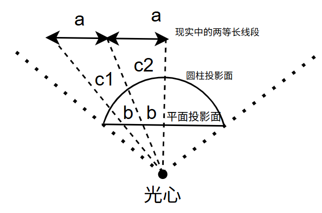
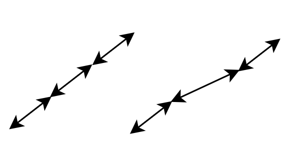
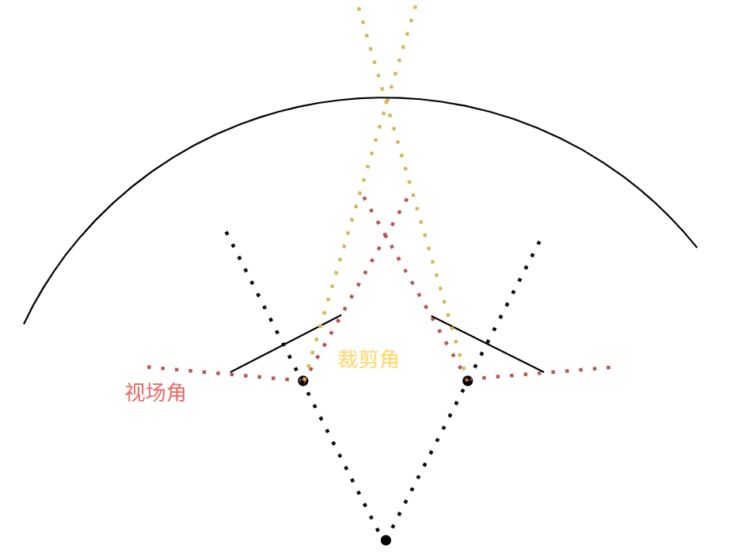

# 柱面投影建模

如图，将平面投影面映射到圆柱投影面上，可以容易得出结论，

现实中平行平面投影面的等长线段，在平面投影的图像上也是等长的，

但是在圆柱投影面上的图像，中间的放大程度大于两边。

所以，如果只做水平的圆柱投影，这就会导致如下情况

原本在对角上的直线变弯了

多相机的圆柱投影：

很明显，柱面投影选取的圆柱应该是一个大圆柱，而不是每个相机一个小圆柱

大圆柱的圆心很好确定，是两个相机中轴线的交点，但是如果超过两个相机，中轴线不止一个交点，圆心应该选在几个交点的中心位置

大圆柱的半径可以根据之前分析的距离对重叠区域的影响，选一个能适应大多数情景的距离，这样两个相机的裁剪角的交点应该就在大圆弧上

确认了大圆柱的圆心和半径后，我们就可以把平面的图像映射到柱面上了。

实际上，两个裁剪线的上半部分区域会在拼接图的左右部分都出现一次，两个裁剪线的下半部分，在拼接图中不会出现，

不过因为裁剪线的夹角应该很小，所以这个影响也很小。

至于圆柱投影有什么用，应该是使拼接后的图看起来更自然，不会像平面投影在交界处那么割裂。
